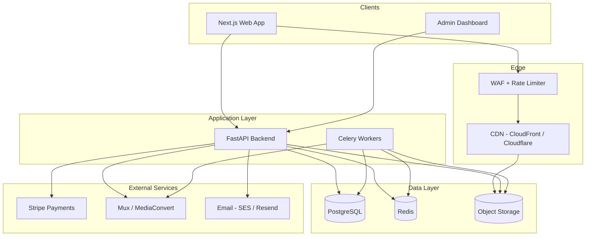
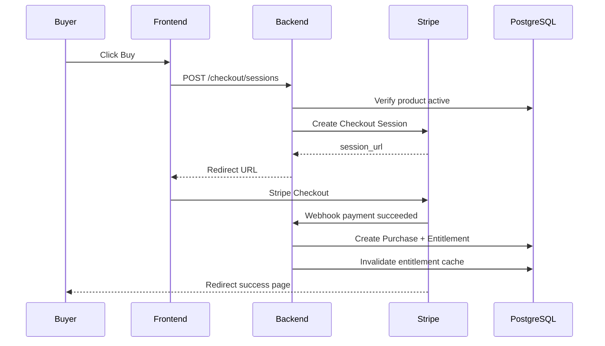
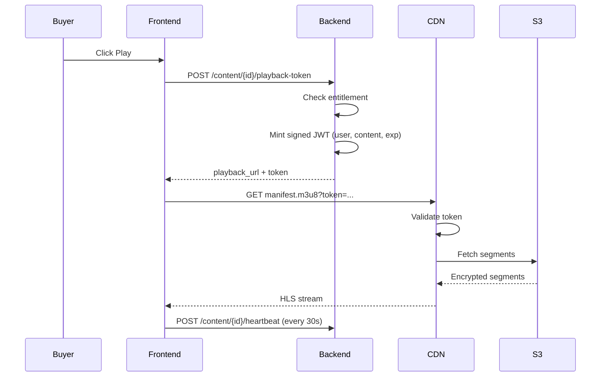

# DigiMart — System Architecture

## 1. Problem statement

Build a marketplace where:

- **Creators** upload video tutorials, presentations (PDF/PPTX), and notes (PDF/Markdown).
- **Buyers** discover content, pay once or subscribe, and consume it in-browser.
- **Platform** enforces access control and reduces leakage via technical controls and legal policies.

No architecture eliminates piracy entirely. Goal: raise the cost of leakage high enough that casual sharing is blocked, and traceable when it happens.

---

## 2. High-level architecture



---

## 3. Core services

### 3.1 Identity & access service

| Responsibility | Implementation |
|----------------|----------------|
| Registration / login | Email + password; optional OAuth (Google) |
| JWT access + refresh tokens | Access: 15 min; Refresh: 7 days, rotated |
| Roles | `buyer`, `creator`, `admin` (user can hold multiple) |
| MFA | TOTP for creators and admins (Phase 3+) |

**Rule:** Every protected endpoint validates JWT, loads user, checks role + resource ownership.

### 3.2 Catalog service

- Products bundle one or more **content items** (video, presentation, notes).
- Supports **one-time purchase** and **subscription** (monthly/yearly per product or platform-wide).
- Creator storefront pages at `/creator/{slug}`.
- Search via PostgreSQL full-text (Phase 1–2); Elasticsearch optional at scale.

### 3.3 Upload & ingest service

```
Creator uploads file
    → API validates type/size, creates ContentItem (status: uploading)
    → Presigned PUT URL returned; client uploads direct to S3
    → S3 event / webhook triggers Worker
    → Worker: virus scan, transcode (video), generate thumbnails, extract PDF pages
    → ContentItem status → ready | failed
```

**Upload limits (defaults):**

| Type | Max size | Allowed formats |
|------|----------|-----------------|
| Video | 5 GB | mp4, mov, webm |
| Presentation | 200 MB | pdf, pptx |
| Notes | 50 MB | pdf, md, docx |

### 3.4 Entitlement service

Single source of truth for "can user X access content Y?"

```
has_access(user_id, content_id) =
    user is admin
    OR user is creator of content
    OR active Purchase for product containing content
    OR active Subscription covering product
    AND content.status == ready
    AND creator account not suspended
```

Cache entitlements in Redis (TTL 5 min); invalidate on purchase/refund/cancel.

### 3.5 Playback & delivery service

**Never expose raw S3 URLs to clients.**

| Content type | Delivery method |
|--------------|-----------------|
| Video | HLS (.m3u8) via CDN; AES-128 segment encryption; short-lived signed manifest URL |
| PDF / PPTX | Convert PPTX → PDF server-side; serve via signed URL + in-app PDF.js viewer |
| Notes (MD) | Render server-side to HTML; no raw file download in MVP |

Flow:

```
Buyer clicks Play
    → API checks entitlement + rate limits
    → API mints signed playback token (JWT, 2–5 min TTL, binds user_id + content_id + session_id)
    → CDN validates token at edge (Lambda@Edge or Cloudflare Worker)
    → Stream / render content
    → Audit log: view_started, view_heartbeat, view_ended
```

### 3.6 Payment service

- **Stripe Checkout** for one-time purchases.
- **Stripe Billing** for subscriptions.
- Webhooks: `checkout.session.completed`, `invoice.paid`, `customer.subscription.deleted`, `charge.refunded`.
- Platform fee: configurable % (e.g. 15%) via Stripe Connect (creators as connected accounts).

### 3.7 Notification service

- Email: purchase confirmation, subscription renewal, content ready, refund.
- In-app notifications table (Phase 2+).

---

## 4. Deployment topology

### MVP (single region)

```
┌─────────────────────────────────────────────┐
│  VPS / Railway / Fly.io / AWS ECS           │
│  ┌─────────┐  ┌─────────┐  ┌─────────────┐  │
│  │ Next.js │  │ FastAPI │  │ Celery x2   │  │
│  └─────────┘  └─────────┘  └─────────────┘  │
└─────────────────────────────────────────────┘
         │              │              │
    PostgreSQL       Redis          S3 + CDN
    (managed)      (managed)       (managed)
```

### Production (recommended)

| Component | Service |
|-----------|---------|
| Frontend | Vercel or CloudFront + S3 static |
| API | AWS ECS Fargate or Railway (2+ replicas) |
| Workers | Separate ECS service, auto-scale on queue depth |
| DB | RDS PostgreSQL Multi-AZ |
| Redis | ElastiCache |
| Storage | S3 private buckets |
| CDN | CloudFront with Origin Access Control |
| Secrets | AWS Secrets Manager / Doppler |
| CI/CD | GitHub Actions |

### Environments

- `development` — local Docker Compose
- `staging` — full stack, test Stripe keys
- `production` — live keys, WAF enabled

---

## 5. Data flow diagrams

### 5.1 Purchase flow



### 5.2 Video playback flow



---

## 6. Key design decisions

| Decision | Choice | Rationale |
|----------|--------|-----------|
| Monolith vs microservices | Modular monolith (FastAPI) | Faster MVP; split later if needed |
| Direct-to-S3 upload | Presigned URLs | Keeps large files off API servers |
| Video host | Mux (MVP) or self-hosted ffmpeg | Mux reduces ops; self-host cuts cost at scale |
| PDF protection | Viewer-only + watermark; no download button | Download prevention is UX + policy, not absolute |
| Multi-tenancy | Row-level (creator_id on all content) | Simple; adequate for marketplace |
| Idempotency | Stripe webhook handlers must be idempotent | Prevent duplicate entitlements |

---

## 7. Non-functional requirements

| Requirement | Target |
|-------------|--------|
| API availability | 99.9% |
| Video start time | < 3s (p95) on broadband |
| Upload success rate | > 99% with retry |
| Concurrent viewers | 500 per product (MVP); scale with CDN |
| RPO / RTO | 24h backup; 4h recovery |
| GDPR | Export/delete user data endpoints (Phase 4) |

---

## 8. Observability

- **Logging:** Structured JSON (request_id, user_id, action)
- **Metrics:** Prometheus — request latency, queue depth, transcode failures, active streams
- **Tracing:** OpenTelemetry (optional Phase 3)
- **Alerts:** PagerDuty/Opsgenie on payment webhook failures, transcode error rate > 5%

---

## 9. Related documents

- [CODING_STANDARDS.md](CODING_STANDARDS.md) — DRY, permissions, code style
- [SECURITY.md](SECURITY.md) — content protection detail
- [DATABASE.md](DATABASE.md) — schema
- [API.md](API.md) — endpoints
- [DEVELOPMENT_PHASES.md](DEVELOPMENT_PHASES.md) — build order
