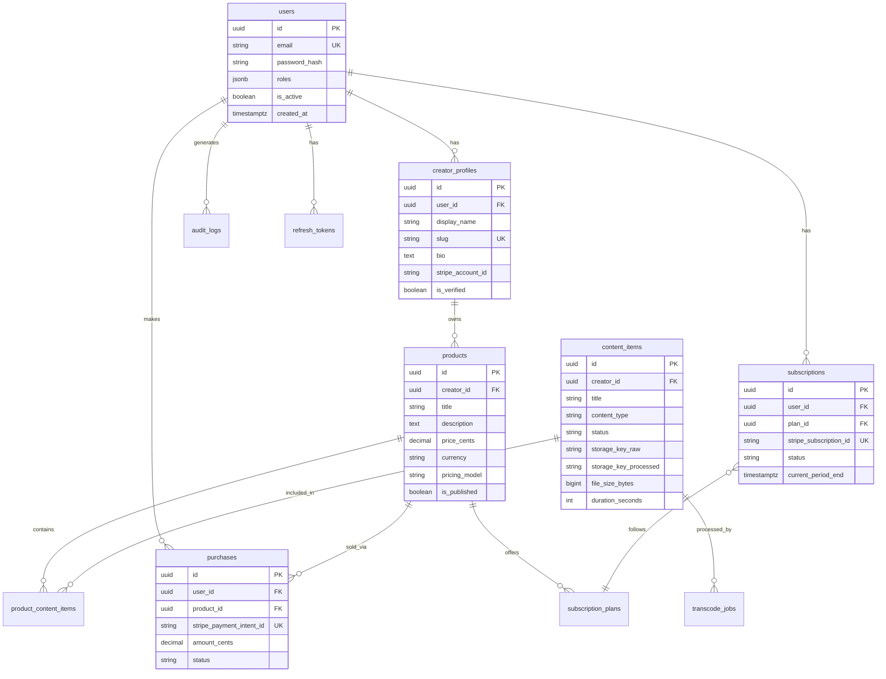

# DigiMart — Database Schema

PostgreSQL 16. All primary keys are UUID v4 unless noted. Timestamps are `timestamptz`.

## Microservice data ownership

DigiMart uses microservices. Each service owns its tables, migrations, and write paths.

| Service | Tables |
|---------|--------|
| Identity | `users`, `refresh_tokens` |
| Catalog | `creator_profiles`, `products`, `product_content_items` |
| Content | `content_items` |
| Media Worker | `transcode_jobs` |
| Payment | `subscription_plans`, `purchases`, `subscriptions`, `stripe_webhook_events` |
| Audit | `audit_logs` |
| Entitlement | no required source-of-truth table in MVP; derives access from payment/catalog/content events and uses Redis cache |
| Playback | playback sessions may start in Redis; add a service-owned table later if persistent sessions are required |

Rules:

- A service may write only to the tables it owns.
- Cross-service writes are forbidden. Publish RabbitMQ events instead.
- Cross-service reads should prefer service APIs. Direct database reads across service ownership are allowed only for read-optimized MVP queries documented in the relevant service and must not become write paths.
- Each service has its own Alembic migration directory under `backend/services/{service}/alembic/`.
- Event consumers that update local projections must be idempotent.

---

## Entity relationship diagram



---

## Tables

### users

```sql
CREATE TABLE users (
    id              UUID PRIMARY KEY DEFAULT gen_random_uuid(),
    email           VARCHAR(255) NOT NULL UNIQUE,
    password_hash   VARCHAR(255) NOT NULL,
    roles           JSONB NOT NULL DEFAULT '["buyer"]',  -- ["buyer","creator","admin"]
    is_active       BOOLEAN NOT NULL DEFAULT TRUE,
    email_verified  BOOLEAN NOT NULL DEFAULT FALSE,
    mfa_secret      VARCHAR(64),  -- encrypted TOTP secret, nullable
    created_at      TIMESTAMPTZ NOT NULL DEFAULT NOW(),
    updated_at      TIMESTAMPTZ NOT NULL DEFAULT NOW()
);

CREATE INDEX idx_users_email ON users(email);
```

### creator_profiles

```sql
CREATE TABLE creator_profiles (
    id                  UUID PRIMARY KEY DEFAULT gen_random_uuid(),
    user_id             UUID NOT NULL UNIQUE REFERENCES users(id) ON DELETE CASCADE,
    display_name        VARCHAR(120) NOT NULL,
    slug                VARCHAR(80) NOT NULL UNIQUE,
    bio                 TEXT,
    avatar_url          VARCHAR(512),
    stripe_account_id   VARCHAR(64),  -- Stripe Connect account
    is_verified         BOOLEAN NOT NULL DEFAULT FALSE,
    created_at          TIMESTAMPTZ NOT NULL DEFAULT NOW(),
    updated_at          TIMESTAMPTZ NOT NULL DEFAULT NOW()
);

CREATE INDEX idx_creator_profiles_slug ON creator_profiles(slug);
```

### content_items

```sql
CREATE TYPE content_type AS ENUM ('video', 'presentation', 'notes');
CREATE TYPE content_status AS ENUM ('uploading', 'processing', 'ready', 'failed', 'removed');

CREATE TABLE content_items (
    id                      UUID PRIMARY KEY DEFAULT gen_random_uuid(),
    creator_id              UUID NOT NULL REFERENCES creator_profiles(id) ON DELETE CASCADE,
    title                   VARCHAR(255) NOT NULL,
    description             TEXT,
    content_type            content_type NOT NULL,
    status                  content_status NOT NULL DEFAULT 'uploading',
    storage_key_raw         VARCHAR(512),      -- s3 path to original upload
    storage_key_processed   VARCHAR(512),      -- s3 path or mux asset id
    file_size_bytes         BIGINT,
    duration_seconds        INT,               -- video only
    mime_type               VARCHAR(128),
    thumbnail_url           VARCHAR(512),
    processing_error        TEXT,
    created_at              TIMESTAMPTZ NOT NULL DEFAULT NOW(),
    updated_at              TIMESTAMPTZ NOT NULL DEFAULT NOW()
);

CREATE INDEX idx_content_items_creator ON content_items(creator_id);
CREATE INDEX idx_content_items_status ON content_items(status);
```

### products

```sql
CREATE TYPE pricing_model AS ENUM ('one_time', 'subscription', 'both');

CREATE TABLE products (
    id              UUID PRIMARY KEY DEFAULT gen_random_uuid(),
    creator_id      UUID NOT NULL REFERENCES creator_profiles(id) ON DELETE CASCADE,
    title           VARCHAR(255) NOT NULL,
    slug            VARCHAR(120) NOT NULL,
    description     TEXT,
    price_cents     INT NOT NULL DEFAULT 0,       -- one-time price
    currency        CHAR(3) NOT NULL DEFAULT 'USD',
    pricing_model   pricing_model NOT NULL DEFAULT 'one_time',
    is_published    BOOLEAN NOT NULL DEFAULT FALSE,
    cover_image_url VARCHAR(512),
    created_at      TIMESTAMPTZ NOT NULL DEFAULT NOW(),
    updated_at      TIMESTAMPTZ NOT NULL DEFAULT NOW(),
    UNIQUE(creator_id, slug)
);

CREATE INDEX idx_products_creator ON products(creator_id);
CREATE INDEX idx_products_published ON products(is_published) WHERE is_published = TRUE;
```

### product_content_items (junction)

```sql
CREATE TABLE product_content_items (
    product_id      UUID NOT NULL REFERENCES products(id) ON DELETE CASCADE,
    content_id      UUID NOT NULL REFERENCES content_items(id) ON DELETE CASCADE,
    sort_order      INT NOT NULL DEFAULT 0,
    PRIMARY KEY (product_id, content_id)
);
```

### subscription_plans

```sql
CREATE TYPE billing_interval AS ENUM ('month', 'year');

CREATE TABLE subscription_plans (
    id                      UUID PRIMARY KEY DEFAULT gen_random_uuid(),
    product_id              UUID NOT NULL REFERENCES products(id) ON DELETE CASCADE,
    name                    VARCHAR(120) NOT NULL,
    price_cents             INT NOT NULL,
    currency                CHAR(3) NOT NULL DEFAULT 'USD',
    billing_interval        billing_interval NOT NULL,
    stripe_price_id         VARCHAR(64) NOT NULL,
    is_active               BOOLEAN NOT NULL DEFAULT TRUE,
    created_at              TIMESTAMPTZ NOT NULL DEFAULT NOW()
);
```

### purchases

```sql
CREATE TYPE purchase_status AS ENUM ('pending', 'completed', 'refunded', 'failed');

CREATE TABLE purchases (
    id                          UUID PRIMARY KEY DEFAULT gen_random_uuid(),
    user_id                     UUID NOT NULL REFERENCES users(id),
    product_id                  UUID NOT NULL REFERENCES products(id),
    stripe_checkout_session_id  VARCHAR(128) UNIQUE,
    stripe_payment_intent_id    VARCHAR(128) UNIQUE,
    amount_cents                INT NOT NULL,
    currency                    CHAR(3) NOT NULL DEFAULT 'USD',
    platform_fee_cents          INT NOT NULL DEFAULT 0,
    status                      purchase_status NOT NULL DEFAULT 'pending',
    created_at                  TIMESTAMPTZ NOT NULL DEFAULT NOW(),
    updated_at                  TIMESTAMPTZ NOT NULL DEFAULT NOW()
);

CREATE INDEX idx_purchases_user ON purchases(user_id);
CREATE INDEX idx_purchases_product ON purchases(product_id);
CREATE UNIQUE INDEX idx_purchases_user_product_completed
    ON purchases(user_id, product_id) WHERE status = 'completed';
```

### subscriptions

```sql
CREATE TYPE subscription_status AS ENUM ('active', 'past_due', 'canceled', 'incomplete');

CREATE TABLE subscriptions (
    id                      UUID PRIMARY KEY DEFAULT gen_random_uuid(),
    user_id                 UUID NOT NULL REFERENCES users(id),
    plan_id                 UUID NOT NULL REFERENCES subscription_plans(id),
    stripe_subscription_id  VARCHAR(128) NOT NULL UNIQUE,
    status                  subscription_status NOT NULL,
    current_period_start    TIMESTAMPTZ,
    current_period_end      TIMESTAMPTZ,
    canceled_at             TIMESTAMPTZ,
    created_at              TIMESTAMPTZ NOT NULL DEFAULT NOW(),
    updated_at              TIMESTAMPTZ NOT NULL DEFAULT NOW()
);

CREATE INDEX idx_subscriptions_user ON subscriptions(user_id);
CREATE INDEX idx_subscriptions_status ON subscriptions(status);
```

### refresh_tokens

```sql
CREATE TABLE refresh_tokens (
    id          UUID PRIMARY KEY DEFAULT gen_random_uuid(),
    user_id     UUID NOT NULL REFERENCES users(id) ON DELETE CASCADE,
    token_hash  VARCHAR(64) NOT NULL UNIQUE,
    expires_at  TIMESTAMPTZ NOT NULL,
    revoked_at  TIMESTAMPTZ,
    created_at  TIMESTAMPTZ NOT NULL DEFAULT NOW()
);

CREATE INDEX idx_refresh_tokens_user ON refresh_tokens(user_id);
```

### transcode_jobs

```sql
CREATE TYPE job_status AS ENUM ('queued', 'running', 'completed', 'failed');

CREATE TABLE transcode_jobs (
    id              UUID PRIMARY KEY DEFAULT gen_random_uuid(),
    content_id      UUID NOT NULL REFERENCES content_items(id) ON DELETE CASCADE,
    status          job_status NOT NULL DEFAULT 'queued',
    provider        VARCHAR(32) NOT NULL DEFAULT 'ffmpeg',  -- ffmpeg | mux
    external_job_id VARCHAR(128),
    error_message   TEXT,
    started_at      TIMESTAMPTZ,
    completed_at    TIMESTAMPTZ,
    created_at      TIMESTAMPTZ NOT NULL DEFAULT NOW()
);
```

### audit_logs (append-only)

```sql
CREATE TABLE audit_logs (
    id          BIGSERIAL PRIMARY KEY,
    user_id     UUID REFERENCES users(id),
    action      VARCHAR(64) NOT NULL,
    resource_type VARCHAR(64),
    resource_id UUID,
    metadata    JSONB NOT NULL DEFAULT '{}',
    ip_address  INET,
    user_agent  TEXT,
    created_at  TIMESTAMPTZ NOT NULL DEFAULT NOW()
);

CREATE INDEX idx_audit_logs_user ON audit_logs(user_id);
CREATE INDEX idx_audit_logs_action ON audit_logs(action);
CREATE INDEX idx_audit_logs_created ON audit_logs(created_at);
```

### stripe_webhook_events (idempotency)

```sql
CREATE TABLE stripe_webhook_events (
    id              UUID PRIMARY KEY DEFAULT gen_random_uuid(),
    stripe_event_id VARCHAR(128) NOT NULL UNIQUE,
    event_type      VARCHAR(128) NOT NULL,
    processed_at    TIMESTAMPTZ NOT NULL DEFAULT NOW(),
    payload         JSONB NOT NULL
);
```

---

## Entitlement query (reference)

```sql
-- Returns TRUE if user has access to content
SELECT EXISTS (
    -- Creator owns content
    SELECT 1 FROM content_items ci
    JOIN creator_profiles cp ON cp.id = ci.creator_id
    WHERE ci.id = :content_id AND cp.user_id = :user_id

    UNION

    -- One-time purchase
    SELECT 1 FROM product_content_items pci
    JOIN purchases p ON p.product_id = pci.product_id
    WHERE pci.content_id = :content_id
      AND p.user_id = :user_id
      AND p.status = 'completed'

    UNION

    -- Active subscription
    SELECT 1 FROM product_content_items pci
    JOIN subscription_plans sp ON sp.product_id = pci.product_id
    JOIN subscriptions s ON s.plan_id = sp.id
    WHERE pci.content_id = :content_id
      AND s.user_id = :user_id
      AND s.status = 'active'
      AND s.current_period_end > NOW()
);
```

---

## Redis cache keys

| Key pattern | TTL | Value |
|-------------|-----|-------|
| `entitlement:{user_id}:{content_id}` | 300s | `1` or `0` |
| `rate:playback:{user_id}` | 60s | counter |
| `session:streams:{user_id}` | 3600s | set of session_ids |

---

## Migrations

Use Alembic. Naming: `{revision}_{short_description}.py`.

Service migration order:

1. identity: users, refresh_tokens
2. catalog: creator_profiles, products, product_content_items
3. content: content_items
4. media-worker: transcode_jobs
5. payment: subscription_plans, purchases, subscriptions, stripe_webhook_events
6. audit: audit_logs
